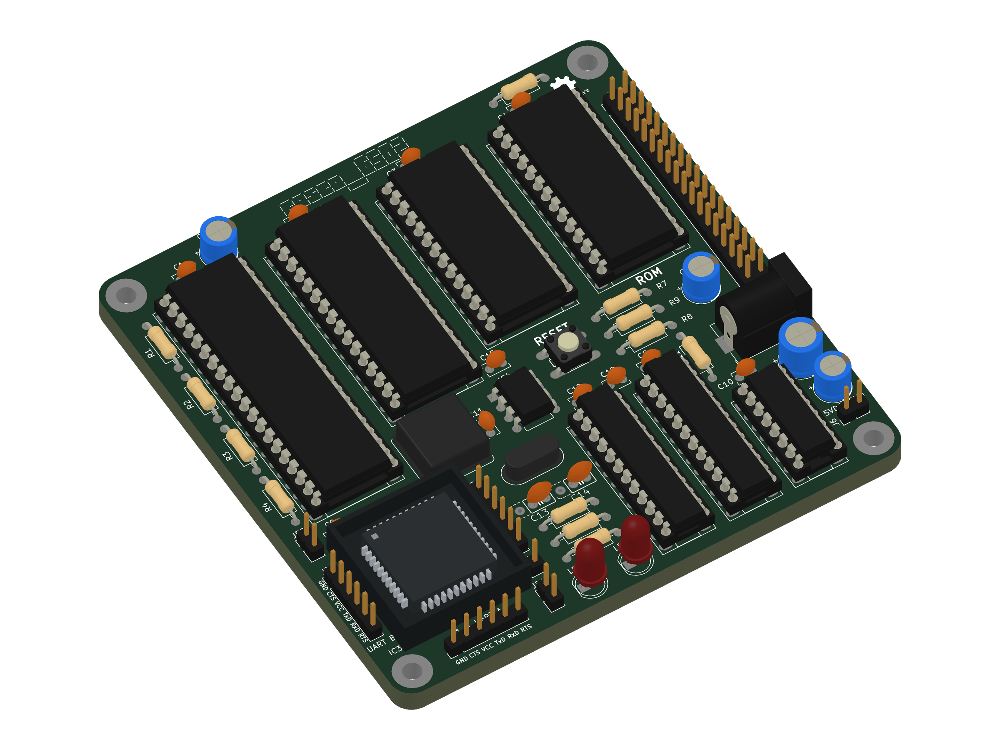

# Really Old-School Computer - 6502

## A 65C02 Single-Board Computer

This repository holds design files, firmware and software for the Really Old-School Computer
(6502) single-board computer, AKA the rosco_6502. This is a fully-featured, programmable,
extensible and capable 8-bit retro computer that is completely open source.

The rosco_6502 is the "little brother" of the popular [rosco_m68k](https://github.com/rosco-m68k)
m68k computer. It is made by the same people, and shares the ethos of being powerful, extensible
and above all, fun.

This project contains all the design files and source code for the project.

* All Software released under the MIT licence. See LICENSE for details.
* All Hardware released under the CERN Open Hardware licence. See LICENCE.hardware.txt.
* All Documentation released under Creative Commons Attribution. See <https://creativecommons.org/licenses/by/2.0/uk/>

## Documentation

Start with the [documentation index](docs/README.md).

* [Getting started and terminal setup](docs/getting-started.md)
* [Hardware and memory map](docs/hardware.md)
* [Building and programming ROM](docs/rom-firmware.md)
* [Building and programming PLDs](docs/pld-firmware.md)
* [Developing and loading programs](docs/software.md)
* [Troubleshooting](docs/troubleshooting.md)
* [Revision 4 notes](docs/revision-4.md)

## Specifications

### Hardware

The hardware specifications for the rosco_6502 are:

* WDC 65C02 at up-to 14MHz (In theory, 10MHz testing target currently).
* SCN68681C1A44 provides two UARTs, timers and SD Card / SPI / GPIO; the console runs at 38400 bit/s
* 528KB RAM
  * 16KB low RAM ($0000 - $3FFF)
  * 16 x 32KB RAM banks ($4000 - $BFFF)
* 8KB IO space ($C000 - $DFFF)
* 8KB or 32KB (banked) ROM $E000 - $FFFF
* High-speed decode and glue logic handled by Atmel F22V10C PLDs.
* Comprehensive expansion and IO connectors allow the system to be easily expanded!

You can see the electrical designs in [kicad](design/kicad). Programmable logic lives in [pld](code/pld).

### Software

The current firmware uses the cc65 toolchain (`ca65`, `ld65` and `da65`).
It includes hardware initialization, WozMon, SD card access, read-only FAT32
support and boot code that looks for `/ROSC0DE_6502.BIN` on the SD card.
The firmware and filesystem utilities are still under development.

See the [firmware README](code/firmware/rosco_6502/README.md) for build
instructions. The older VASM-based firmware remains in
[firstboot](code/firmware/firstboot) for reference.

### Related tools

* [rosco CLI](https://github.com/solderdemon/rosco-cli): a cross-platform `rosco` command
  that creates, builds and uploads rosco_6502 (and rosco_m68k) programs over UART, or
  runs them in the emulator.
* [rosco-emulator](https://github.com/solderdemon/rosco-emulator): a slimmed-down MAME
  build that emulates the rosco_6502 r4, so programs and firmware can be tested without
  the board.

See [Developing and loading programs](docs/software.md#rosco-cli-and-emulator) for usage.

## Repository layout

* [design/kicad](design/kicad): board schematics and PCB layouts.
* [code/pld](code/pld): programmable logic sources.
* [code/firmware/rosco_6502](code/firmware/rosco_6502): ca65 firmware and ROM linker configurations.
* [code/firmware/firstboot](code/firmware/firstboot): legacy VASM firmware.
* [code/software](code/software): example programs, tests and filesystem utilities.
* [docs](docs): additional project documentation.
